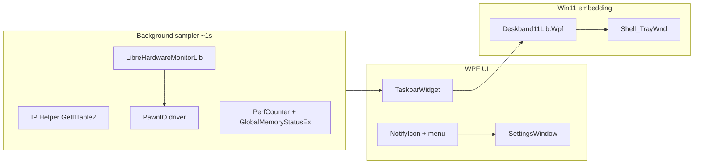
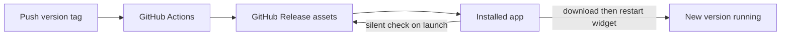

# Fab Hardware Monitor

A new .NET 8 WPF app. Display name **Fab Hardware Monitor**; project/assembly `FabHardwareMonitor`. Primary UI is a compact, transparent widget **embedded in the Windows 11 taskbar** (left of the tray), matching the TrafficMonitor layout you screenshotted — with working CPU temperature and GPU VRAM added.

**Folder:** `e:\Cursor\Fab Hardware Monitor` (rename from `Hardware Monitor` is done).

**Names**

- Folder / product: Fab Hardware Monitor
- csproj / exe / mutex: `FabHardwareMonitor`
- Installer: `FabHardwareMonitor-Setup.exe`
- Scheduled task: `FabHardwareMonitor`
- Settings: `%AppData%\FabHardwareMonitor\settings.json`
- GitHub repo (suggested): `FabHardwareMonitor`

Reference: [TrafficMonitor](https://github.com/zhongyang219/TrafficMonitor)

## Why TrafficMonitor shows `CPU: -- °C`

GPU temp works; CPU temp does not. That is the usual split:

- TrafficMonitor ships an **old LibreHardwareMonitorLib** plus **WinRing0x64.sys**.
- Windows Defender’s **Vulnerable Driver Blocklist** now blocks WinRing0, so CPU MSR/package sensors never populate.
- Even when sensors exist, TM looks for a **hard-coded name** (`CPU Package`). AMD reports `Core (Tctl/Tdie)`; many Intel hybrid CPUs report `Core Average` / `Core Max` instead.
- CPU temp needs **admin + a current kernel backend**. GPU temp often still works via NVAPI/ADL without that driver.

Our app will not reuse TrafficMonitor’s bundled DLL. It will use current [LibreHardwareMonitorLib](https://www.nuget.org/packages/LibreHardwareMonitorLib/) (0.9.6+) which talks to **PawnIO** instead of WinRing0, run elevated, and pick the first valid CPU temp from a name fallback list.

## Architecture



Split sampling on purpose: **network / CPU% / RAM still work if temperature access fails**.

## Stack

- **.NET 8** WPF, `net8.0-windows`, single-file publish optional later
- **LibreHardwareMonitorLib** for CPU/GPU temps, GPU load, VRAM
- **PawnIO** (installer / first-run installs the official driver if missing; user can skip)
- **Deskband11Lib.Wpf** for Win11 taskbar parenting, centered-taskbar gap, explorer.exe restart, DPI ([NuGet](https://www.nuget.org/packages/Deskband11Lib.Wpf))
- **CommunityToolkit.Mvvm** for the widget bindings
- `app.manifest` with `requireAdministrator` so CPU sensors can actually be read
- Settings JSON under `%AppData%\FabHardwareMonitor\settings.json`

## Taskbar UI (matches your screenshot)

Two rows, four columns, white text, transparent background so the taskbar texture shows through. **CPU temp is top-right; GPU temp is bottom-right** (swapped from the earlier draft):

```
↑  0.0 K/s     CPU  12%     GPU   0%     CPU  45°C
↓  0.0 K/s     MEM  60%     VRAM  8%     GPU  50°C
```

- Same compact TrafficMonitor density (fits standard 48px taskbar height).
- Right-click: Settings / Details / Exit.
- Left-click: small flyout with extra sensors (per-core optional later; v1 shows CPU name, GPU name, chosen temp sensor).
- Color thresholds: e.g. CPU/GPU temp turns amber ≥80°C, red ≥90°C; usage amber ≥80%, red ≥95%.
- Tray icon so the app can be recovered if explorer restarts before re-embed.

Placement: `BeforeNotificationArea` (same as TrafficMonitor: just left of the chevron/Wi‑Fi/clock).

## CPU temperature — the actual fix

`SensorResolver` will walk LHM sensors after each update and pick:

1. `CPU Package` (Intel)
2. `Core Average` / `CPU Core Average`
3. `Core Max` / `CPU Core Max`
4. `Core (Tctl/Tdie)` (AMD)
5. `CPU CCD Average` / first CCD
6. Any remaining `HardwareType.Cpu` + `SensorType.Temperature` with a non-null value (skip `Distance to TjMax`)

GPU temp: `GPU Core` → first GPU temperature. GPU usage: `GPU Core` load. VRAM: used/total memory sensors as a percent.

If values are still null:

- Check elevation
- Check `PawnIo` installed/loaded (LHM exposes status)
- If PawnIO is missing, the **installer / first launch** downloads and runs the official [PawnIO](https://github.com/namazso/PawnIO) installer in the same elevated session so the user does not hunt for a second download. Skip is still available; temps stay `--` until it is installed.

Never ship WinRing0.

## Data sources

| Metric | Source |
| --- | --- |
| Up/down speed | `iphlpapi` `GetIfTable2` / `GetIfEntry2`, skip loopback/tunnel; auto-pick busiest NIC or user override |
| CPU % | `Processor Information` → `% Processor Utility` → `_Total` (better than `% Processor Time` on modern CPUs) |
| RAM % | `GlobalMemoryStatusEx` |
| GPU %, VRAM %, GPU/CPU °C | LibreHardwareMonitorLib, `Computer.Open()` once, `Update()` on a background timer (~1s) |

LHM `Computer` flags: CPU, GPU, Memory only (not storage/motherboard) to keep overhead down.

## App behavior — install, autostart, updates (painless)

The end user should not open Task Scheduler, Git, or a second driver page. Flow:

1. Download `FabHardwareMonitor-Setup.exe` from GitHub Releases
2. Run it → UAC once → Finish
3. Widget appears in the taskbar; it already starts at logon

**Autostart is automatic.** The installer (and first launch as a fallback) creates a Task Scheduler task `FabHardwareMonitor` with:

- Trigger: at user logon
- Run with highest privileges (needed for CPU temp)
- Action: the installed `FabHardwareMonitor.exe`

Settings still has a “Start with Windows” checkbox, **on by default**. Uninstall removes the task. The user never runs `schtasks` or creates the task by hand.

**PawnIO** is pulled in during that same setup/first-run so CPU temp works without a homework step. Other metrics keep working if they skip it.

**Updates come from the git repo via GitHub Releases**, not from a manual copy:



- [Velopack](https://github.com/velopack/velopack) packs `Setup.exe` and the update feed
- GitHub Actions on a version tag (`v1.0.1`) publishes a Release with the Velopack assets
- On each launch the app checks Releases, downloads in the background, then **restarts the widget with no prompt**
- Developer deploy: bump version, tag, push. Installed copies pick it up on next start (or immediately after the silent download + restart)

The update URL is the repo’s Releases page (e.g. `https://github.com/<owner>/FabHardwareMonitor`). Creating/pushing that GitHub repo is a one-time setup; after that, tags are the release channel.

Settings: refresh interval, NIC, GPU if multiple, text color, show/hide VRAM, CPU temp sensor override, start with Windows. Single-instance mutex. Graceful `--` only when a metric is truly unavailable.

## Project layout

```
FabHardwareMonitor/
  FabHardwareMonitor.csproj
  App.xaml / App.xaml.cs
  app.manifest
  Views/TaskbarWidget.xaml
  Views/SettingsWindow.xaml
  Views/DetailsFlyout.xaml
  ViewModels/TaskbarViewModel.cs
  Services/HardwareSampler.cs      // LHM + resolver
  Services/NetworkSampler.cs       // IP Helper
  Services/SystemSampler.cs        // CPU% + RAM
  Services/PawnIoGuard.cs
  Services/AutostartService.cs   // create/delete scheduled task; called by installer + first run
  Services/UpdateService.cs      // Velopack silent check against GitHub Releases
  Models/HardwareSnapshot.cs
  Models/AppSettings.cs
  .github/workflows/release.yml  // tag -> build -> Velopack -> GitHub Release
```

## Implementation order

1. Rename folder to `Fab Hardware Monitor` if still at the old path; scaffold WPF project `FabHardwareMonitor` + manifest + tray icon
2. System + network samplers (prove CPU/RAM/net in a normal window)
3. LHM + sensor resolver + PawnIO first-run install (prove CPU temp in that window)
4. Swap the window into the taskbar via Deskband11Lib; CPU °C top-right, GPU °C bottom-right
5. Settings; AutostartService registers the logon task automatically (default on)
6. Velopack installer + silent GitHub Releases updater + release workflow

## Out of scope for v1

Floating always-on-top window, skins, traffic history, plugins, fan control. Taskbar widget + tray + settings + silent GitHub updates is the product.
