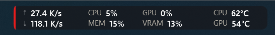

# Fab Hardware Monitor

Windows 11 taskbar widget for network, CPU, RAM, GPU, VRAM, and temperatures. Built as a .NET Windows app (Deskband11Lib requires .NET 10) with a one-click Velopack installer and GitHub Releases updates.

Inspired by [Traffic Monitor](https://github.com/zhongyang219/TrafficMonitor) by [zhongyang219](https://github.com/zhongyang219). Fab Hardware Monitor is a separate app with its own layout, sensors, and installer.

## Layout



Right-click the widget or tray icon: **Settings**, **About**, **Exit**.

## Requirements

- Windows 11
- A UAC prompt only if you install PawnIO for CPU temperature
- [.NET 10 SDK](https://dotnet.microsoft.com/download) to build

CPU temperature uses [LibreHardwareMonitorLib](https://www.nuget.org/packages/LibreHardwareMonitorLib) and the official [PawnIO](https://pawnio.eu) driver. The MSI offers to install PawnIO during setup. You can skip it and install later from Settings; CPU temperature shows as `--` until then. WinRing0 is not shipped.

## Build

```powershell
dotnet publish FabHardwareMonitor/FabHardwareMonitor.csproj -c Release -r win-x64 --self-contained true
```

Run `FabHardwareMonitor.exe` to embed the widget left of the notification area.

## Release

1. `pwsh scripts/release.ps1 -Bump patch` (or `minor` / `major`)
2. GitHub Actions packs Velopack assets and publishes a GitHub Release
3. Installed copies check Releases on launch. Auto-install is on by default; turn it off in Settings and install from About.

## Privacy

The public installer is the **MSI**. It shows `legal/PRIVACY-AND-TERMS.md` and the user must accept it before setup continues. It also explains that CPU temperatures need PawnIO and offers to install the official driver then, or later from Settings. Velopack's `Setup.exe` is one-click and has no licence page. Hardware readings stay on the PC; GitHub is contacted only for updates (and for PawnIO if the bundled installer is missing).

## Settings

`%AppData%\FabHardwareMonitor\settings.json`
